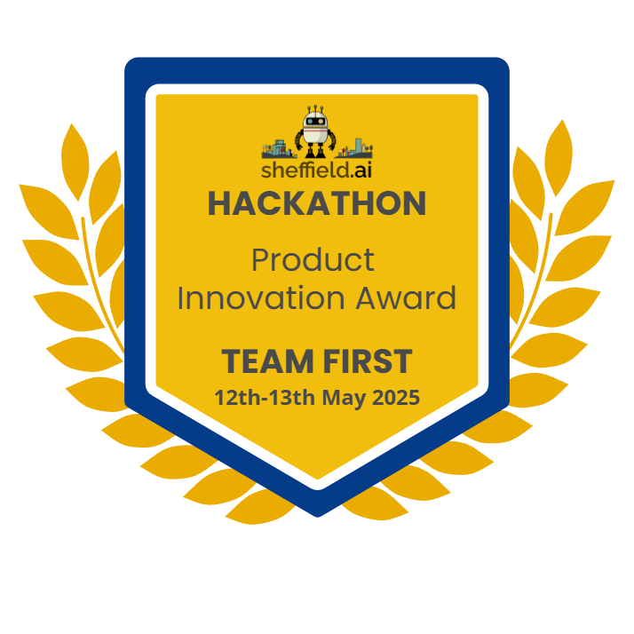
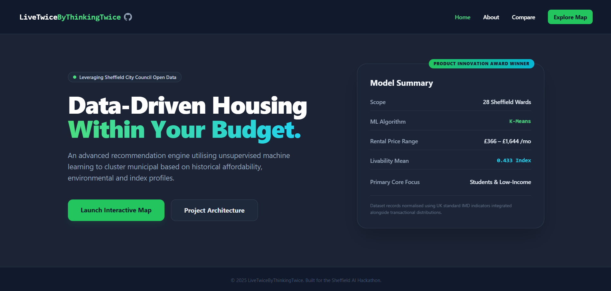
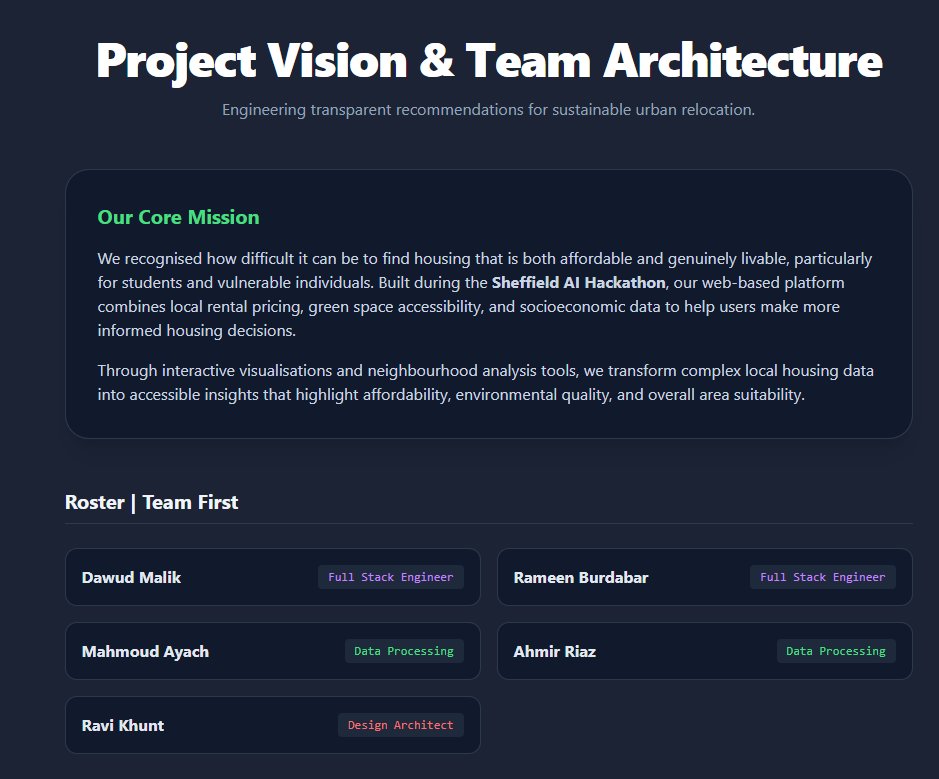
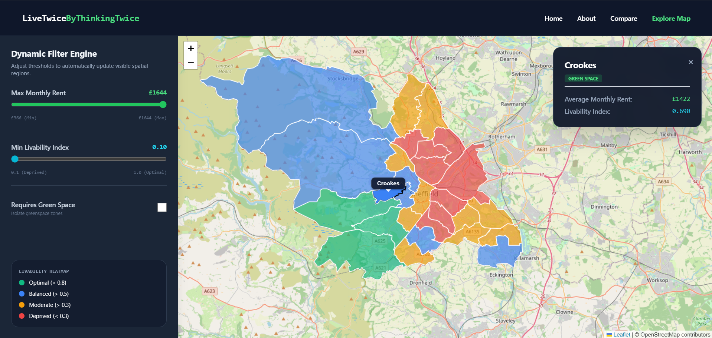
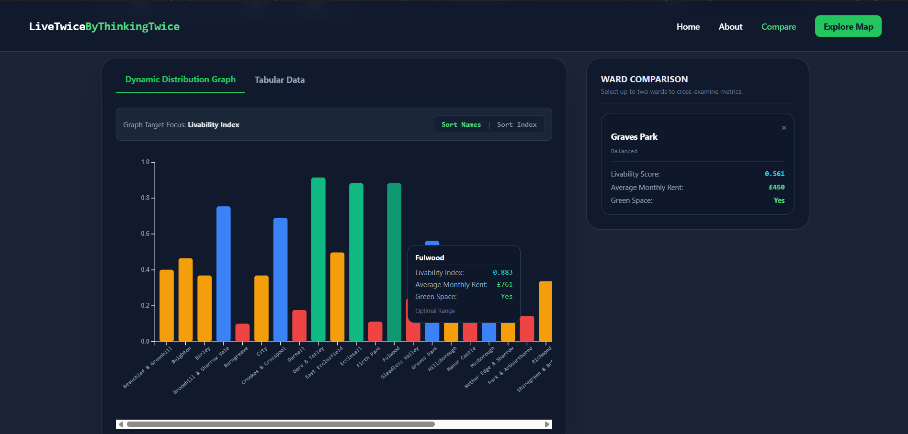
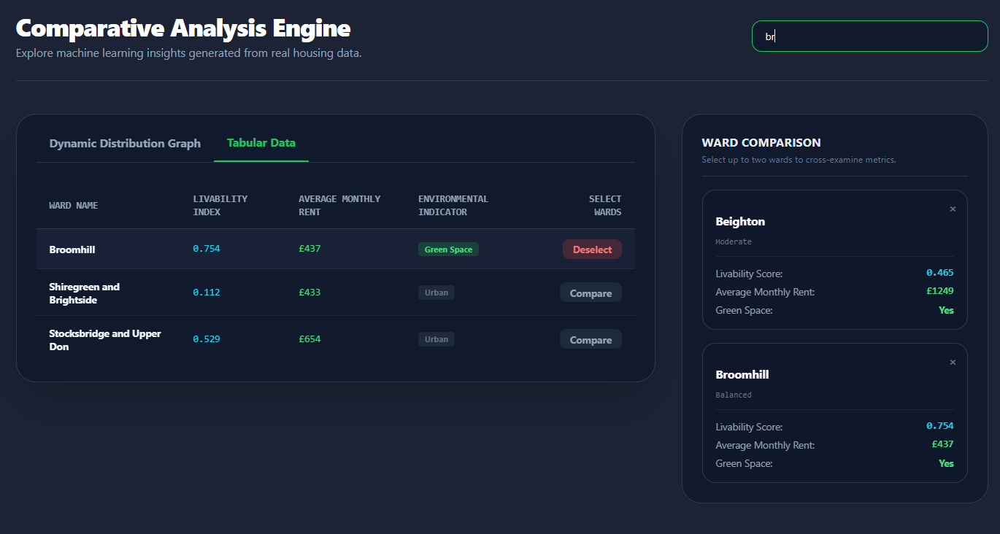

[](https://livetwicebythinkingtwice.netlify.app)

[](https://livetwicebythinkingtwice.netlify.app)
---
[](https://drive.google.com/file/d/1dOmVQjfGieVBV1GWtUbUcnHdzDiFYS1k/view?usp=drive_link/)

***Built for the Sheffield AI Hackathon***
---
**LiveTwiceByThinkingTwice** is an interactive, AI-driven web application designed to help students, families, and low-income individuals find smart housing options within their budget. 

It leverages **unsupervised machine learning (K-Means Clustering)** to cluster Sheffield neighbourhoods based on historical affordability, environmental and liveability indices.

## Dashboard Preview


Home Page
---

About Page
---

Map Preview
---

Comparison Graph Preview
---

Comparison Table Preview
---
## Project Overview
Finding affordable housing is a massive challenge. We built a model leveraging open data from the **Sheffield City Council** to cluster neighbourhoods based on:
- **Liveability:** Using standard UK IMD indicators.
- **Green Areas:** Proximity to parks and environmental zones.
- **Maximum Monthly Rent:** Derived from historical transactional distributions.

Presented **live** on stage, this project was awarded the **Product Innovation Award** for originality and impact.
## Team First | Roster

## Team First | Roster

- **[Dawud Malik](https://www.linkedin.com/in/dawud-malik/)** &nbsp;&nbsp; 
- **[Rameen Burdabar](https://www.linkedin.com/in/rameen-burdabar/)** &nbsp;&nbsp; 
- **[Mahmoud Ayach](https://www.linkedin.com/in/mahmoud-ayach-25339021b/)** &nbsp;&nbsp; 
- **[Ahmir Riaz](https://www.linkedin.com/in/ahmirriaz/)** &nbsp;&nbsp; 
- **[Ravi Khunt](https://www.linkedin.com/in/ravi-khunt01/)** &nbsp;&nbsp; 

## Data Architecture & Sources
Our model focuses strictly on three core pillars of open government data to generate its recommendations:

1. **Housing Affordability (Monthly Rent):** Derived from historical transactional distributions to calculate realistic monthly mortgage and rent costs.

2. **Liveability:** Using standard UK IMD indicators to gauge the overall quality of life and socioeconomic standing of each ward.

3. **Environment (Green Spaces):** Spatial analysis of proximity to parks and environmental zones for users prioritising outdoor access.

**Core Data Links:**
- [UK ONS Geoportal](https://geoportal.statistics.gov.uk/)
- [Sheffield House Price Information](https://www.sheffield.gov.uk/sites/default/files/2022-11/house-price-information.xlsx)
- [English Indices of Deprivation 2019](https://www.gov.uk/government/statistics/english-indices-of-deprivation-2019)
- [Sheffield Parks and Countryside Sites](https://www.data.gov.uk/dataset/90b1db1f-18e1-4e9d-bb52-a4d1c198f6f2/sheffield-parks-and-countryside-sites)
- [Boundaries](https://sheffield-city-council-open-data-sheffieldcc.hub.arcgis.com/search?collection=dataset&layout=grid&tags=elections)


## Technologies Used
* **Frontend:** HTML5, Tailwind CSS, JavaScript
* **Mapping & Visualisation:** Leaflet.js, D3.js
* **Backend / Data Processing:** Python (Pandas, GeoPandas, NumPy, Scikit-Learn)

## How to Run the Project

### **View the App**
View our **Netlify WebPage [HERE](https://livetwicebythinkingtwice.netlify.app/)**

**OR**

The frontend is pre-compiled and ready to go. The ML model's output is already injected into the `sheffield.json` boundary file. Just follow these steps:
- Clone the repository.
- Open `index.html` in your browser.
- Ensure you have an active internet connection to load the CDN scripts.

### **The Hard Way (Run the ML Pipeline)**
If you want to tweak the clustering algorithm or feed it updated data, you can run the Python pipeline yourself. *Note: A 12-row sample output is provided in `final_output/` to demonstrate the target schema without requiring a full run.*

1. **Setup Environment:**
   ```bash
   pip install -r requirements.txt
   ```

2. **Fetch & Prepare Data:**

    Create a `data/` folder in the root directory. Download the datasets from the links above.
    >  

    >The Sheffield House Prices source is an `.xlsx` workbook. You must manually extract the relevant sheets into `.csv` files before the pipeline can process them.

3.  **Customise Configuration (Optional):**
    
    If you are adding new datasets or wards, make sure to update the mappings and constants inside `python/config.json.`

4.  **Execute Pipeline:**
    
    Run the model to process the **raw data**, execute **K-Means clustering**, and generate the **target CSV.**
    > 
    
    > If you changed your raw data **file names**, ensure you update the target file paths and the **<span style="color:red">code in general</span>** inside `python/pipeline.py`. Reference the **csv** file in `final_output/` to ensure the output produced by **YOU** follows the same standard format.
    ```
    python python/pipeline.py
    ```

6.  **Update Map Boundaries:**

    Inject the freshly generated **CSV** data into the **GeoJSON file** used by the frontend dashboard. If your output paths changed in the previous step, update the corresponding paths in `python/updatemap.py` before running.
    ```
    python python/updatemap.py
    ```

# License & Attribution
This project was built for the **Sheffield AI Hackathon.** All data belongs to the **Sheffield City Council**, the **UK Office for National Statistics**, and their respective **Open Data** initiatives. Contains public sector information licensed under the **Open Government Licence v3.0.**
